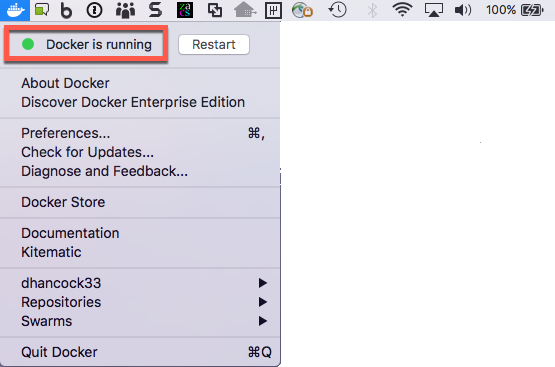
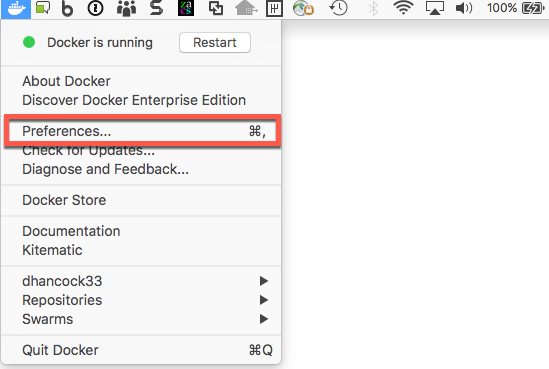
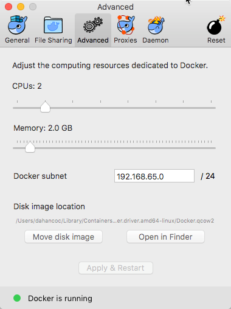
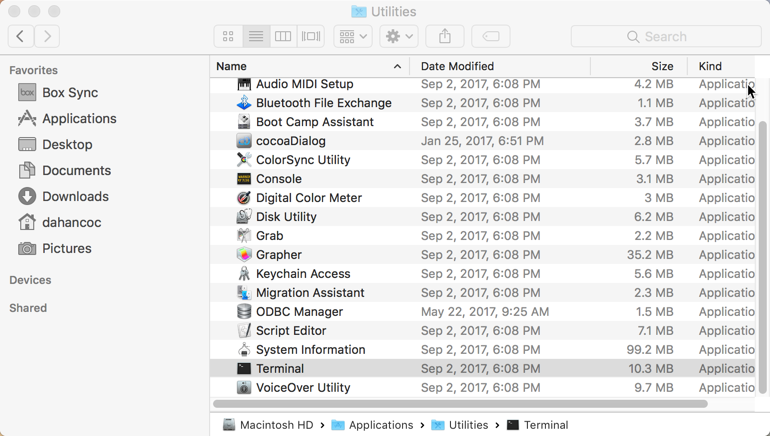
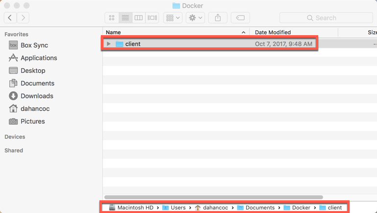

#  Set up procedures for Db2 Warehouse Client CLP/CLI for Mac OSX  

## Install Docker for Mac

1. Follow the instructions at: https://docs.docker.com/docker-for-mac/install/
	* Download Docker for Mac "Get Docker for Mac (Stable)
		*  	Please read the section *"What to know before you install"*. **Docker Machine users must read this section.**

1. Verify that Docker for Mac is running by selecting the Docker icon in the menu bar.     
    
	
    If your Docker for Mac service is not running click *"Restart"*.  
    If  *"Restart"* doesn't start the Docker for Mac service then uninstall and re-install.

1. Optional: Adjust the Docker for Mac preferences.  Click the Docker icon in the menu bar and select 
   
    
   
   * Select *"Advanced"* and change CPUs and Memory settings appropriately. 
   
        
   
      > Note: Typically 2 Cores and 2 GB RAM should be enough for normal operations of the Db2 Warehouse CLP/CLI Client container.

## Deploy the Db2 Warehouse Client Container to your Mac.
  
   > Note: make sure you have a Docker Hub account by signing up at : https://hub.docker.com/
   
   * Create a file on your workstation with your editor of choice and call the file `docker_pw`.  Add your password to the file and save it to a directory.  

   * Open the terminal application (`/Applications/Utilities/terminal`) on your Mac.     
       
     > Note: iterm2 is an alternate terminal application on Mac that you can download and install
   
   * Login to docker using your Docker ID and password.    
     ```
     cat docker_pw |docker login --username <your-docker-id> --password-stdin
     ```
   
   * Create a directory on your mac in `/Users/<your-mac-id>/Documents/Docker/client`  
      
  
   * Deploy the Db2 Warehouse Client container
     > Note: This will take several minutes depending on your network connection.      
     ```
     $ docker run -dit --net=host --privileged=true -v /Users/dahancoc/Documents/Docker/client:/mnt/clientdir --name=client ibmdashdb/local:latest-local_client-linux
     ```
     ```
     Unable to find image 'ibmdashdb/local:latest-local_client-linux' locally
     latest-local_client-linux: Pulling from ibmdashdb/local
     f2d1d709a1da: Downloading [==>                                                ]  3.209MB/71.56MB
     ee7499a95b04: Downloading [>                                                  ]  1.592MB/289MB
     02cff048fc8e: Download complete
     091bf90b7a17: Downloading [>                                                  ]  3.237MB/162.7MB
     05001a6f11e6: Waiting
     f13dc45495a5: Waiting
     25000486f9f5: Waiting
     df375687d6c5: Waiting
     c98669737305: Waiting
     82b8c372222e: Waiting
     4829ba3d9b66: Waiting
     fb270d39f9b2: Waiting
     328059d55f4f: Waiting
     5c28166ff24c: Waiting
     887a50938684: Waiting
     e7dc35fa4889: Waiting
     de397bec3386: Waiting
     da9b7fe866a9: Waiting
     9ca43a153c75: Waiting
     8ef6a25f4544: Waiting
     5ab0913a6945: Waiting
     426d75f7e94a: Waiting
     c238b4ea0ce1: Waiting
     9fb06bb0e0e1: Waiting
     a94ac5f477e9: Waiting
     c568ae25c750: Waiting
     5f03c6d53ea9: Waiting
     3ff8bd5361aa: Waiting
     38e3e797b99d: Waiting
     170652e40c42: Waiting
     892a2de42b7e: Waiting
     d6ac5ebe740c: Waiting
     3c3dc78c541f: Waiting
     17b0f660085f: Waiting
     ```  

   * Access the Db2 Warehouse container command line  

     `docker exec -it client cli`  

## Troubleshooting

### Check the Db2 Warehouse Client Container Logs.
  
   `docker logs --follow client`  
   
### Access the Db2 Warehouse container command line  

   `docker exec -it client cli`  

### Stop the Db2 Warehouse container   

   `docker stop client`  

### Start the Db2 Warehouse container   

   `docker start client`  
   
### Check Db2 Warehouse container state  

   `docker ps -a`  
