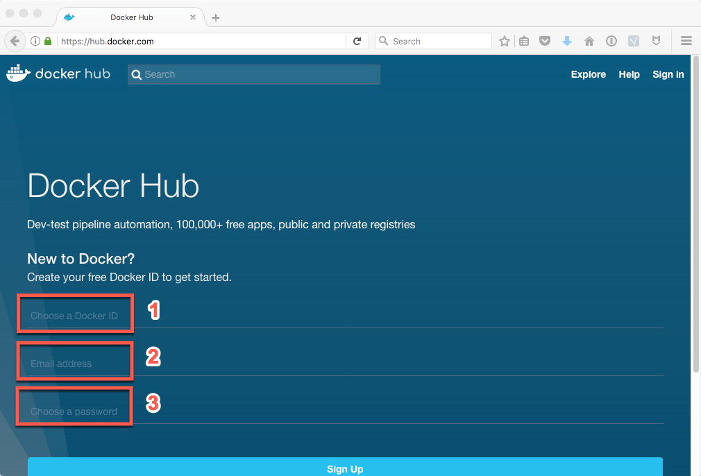

# Sign-up for a Docker Hub Account

1. Go to the Docker Hub Website and create a Docker account: [Sign-up](https://hub.docker.com/) 

    
  
  ```
   Enter a Docker ID (1)
   Enter Email address (2)
   Choose Password (3)
   ```
   
   Note: Keep track of your Docker ID.  This ID is need to request access the Db2 Warehouse Client Container.
