# A walk through of a IBM Data Science Experience (DSX) console
1. Login into the DSX console
   
1. You should be looking at the main dashboard for DSX.
   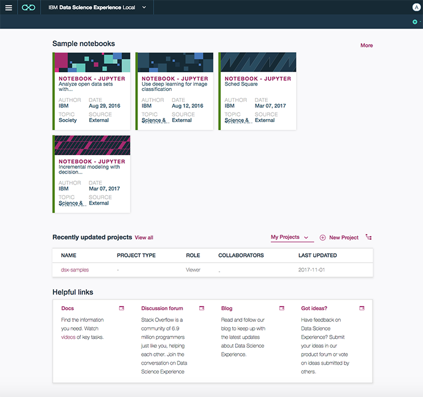
1. If you are an **Admin** you can toggle the name icon to pick the ***IBM Data Platform Manager*** or stay on the ***Data Science Experience*** console.
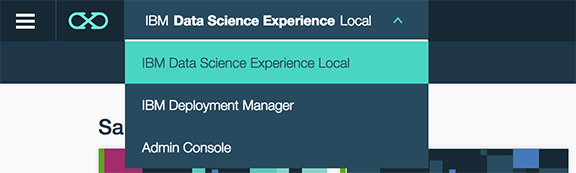

## View of an  admin
1. Select **Admin Console**.
1. Here is the main dashboard.
 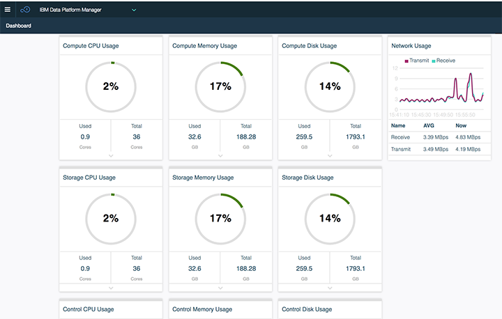
1. **Click** the 3 bar hamburger in the upper left to open the menu.
1. Review the options avaialble.  **DashBoard, Nodes, Cluster Log, Services, Pods, User Management and  Alerts**
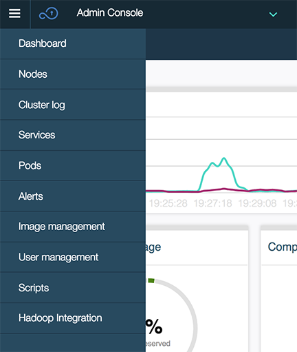
1. Since you already saw the Main Dashboard, move down to the **Nodes**.  **Click** on **Nodes**.  **Note:** There are ***Control Plane, Worker*** and ***Storage Nodes*** avaialble.
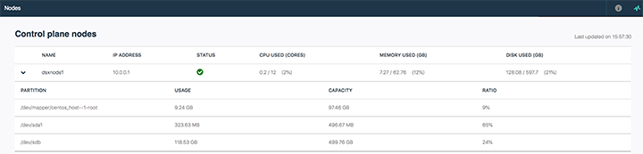
1. Once you are finished reviewing the ***Nodes***, **click** though to the **Cluster Log**.  Here you can filter, choose and research what is happening in the system
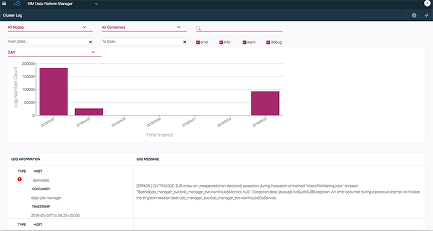
1. **Click** on  **Services**.  This will list out all the services enabled on the system.  
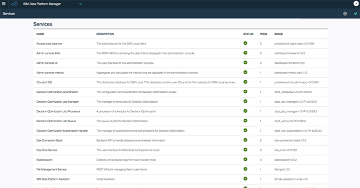
1. **Click** on one, the lab follows Cloudant.

1. **Click** on **Pods**.  DSX is managed by ***Kubernetes***.  Kubernetes is a orchestration framework that runs ***Docker*** containers.  Each pod is an execution engine of a give Docker image.  You will notice that over time, the number of pods will increase for each proeject runtime deployed.
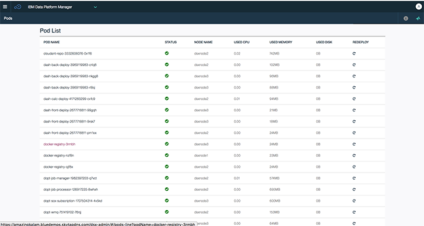
1. Drill down into a pod, this lab picked ***Cloudant***.  These are just quick ways to see what resources that each runtime instance is taking on the entire system.  
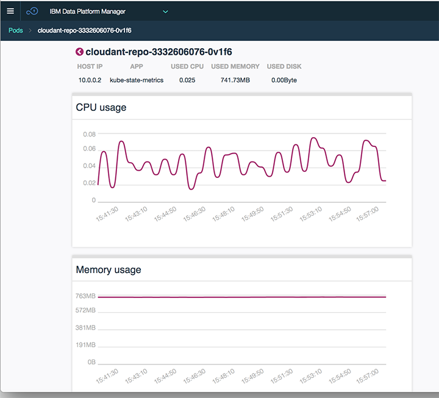
1. Go ahead and look at more if desired.
1. **Click** on **User Management**.  Here is where the admin will add users to the system or an external LDAP.  At this time there are two levels of security.  ***Admin*** or ***User***.    Admin gives you access to the Data Platform Manager function and User gives you only access to Data Science Experience and the project you create or are part of the group.
  * In the upper right, the ***+Add user***.
  * To right most side of each user, there are two icons.
    * A ***Pencil***, this allows one to edit the user.
    * A ***Trashcan***, this allows one to delete the user.
  * In the upper left, next to ***User List***  is **Set Up LDAP**.  Here is where you can configure and external LDAP.
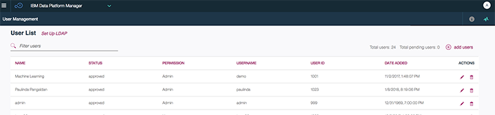  
  * **Click** on **Add LDAP**.  Here are the configuration needs to get LDAP working.
  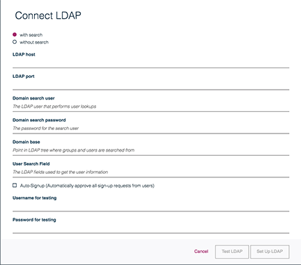
1. **Click** on the Menu > Alerts
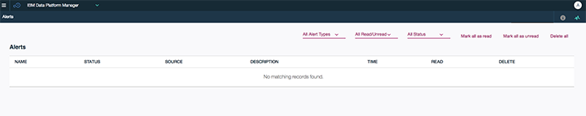

This has been a high level overview of ***Data Platform Manager*** of Data Science Expereince.

## View of a user
1. Here is the main dashboard.
 
1. **Click** the 3 bar hamburger in the upper left to open the menu.
1. Review the options avaialble.  **Community, Projects, Model Management, Tools** and **Runtimes**.
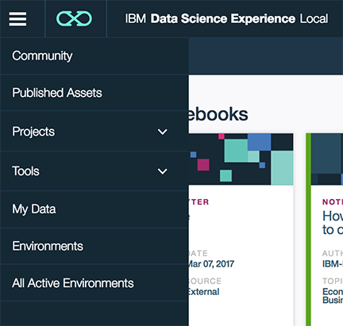
1. **Click** on **Community**.   These are all sample project to get you started on your journey.  These samples are listed with Topic or industry, hopefully making the sample more interesting.
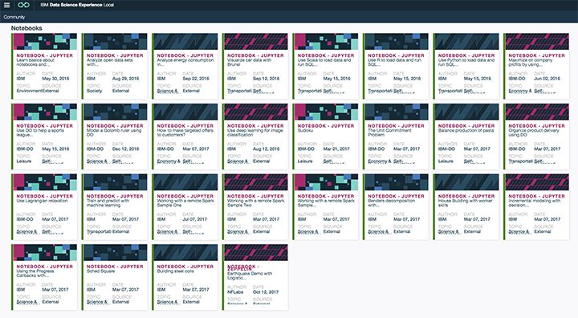
1. Let's leave ***Projects*** for last, as the next section will be creating a sample project and notebook.  **Click** on **Model Management**.  Here you can see ***Published*** Machine Learning Models by other people on the system.  Which deployments are called most often, which deployments have the best runtimes.   This is made available, so that a user can see what others are using.  Maybe not replicate the same work, hence increasing productivity.
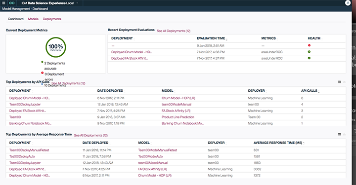
1. **Click** on the hamburger menu icon, Expand **Tools**.  Notice the list of tools available:
    * Jupyter.
    * RStudio.
    * Zeppelin.
    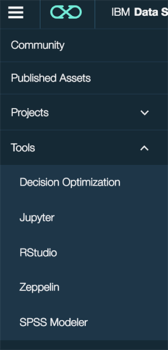
  1. **Click** on **Tools>Jupyter**  **Note:**  This opens up to ***Create a Notebook***.   From here you can create a **Jupyter** or **Zeppelin** notebook.   One difference is that Jupyter notebooks also you to select the language where Zeppelin notebooks.
  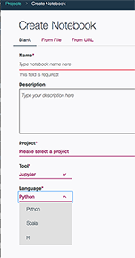
  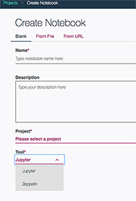
  1. **Click** on **Tools>RStudio** This will open RStudio in the context of the project that you are working.
  
1. **Click** on **Runtimes**.  This lists all of the runtimes that are owned by this user.
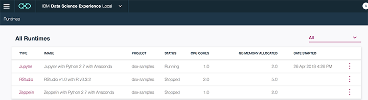
  1. Drilling into the ***Jupyter Runtime***, one can adjust the number of cores and see memory statistics.
  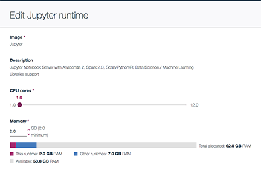
  1. Drilling into the ***RStudio Runtime***, one can adjust the number of cores and see memory statistics.
  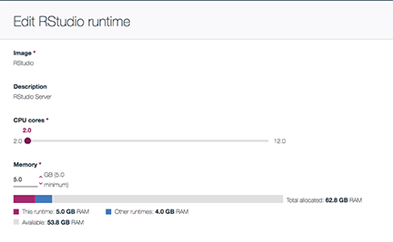
  1. Drilling into the ***Zeppelin Runtime***, one can adjust the number of cores and see memory statistics.
  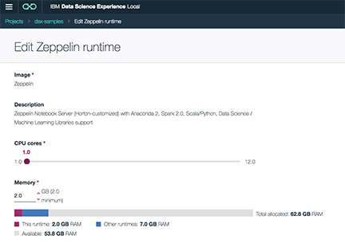

***This concludes the user experience.***

## Create a sample project and Jupyter notebook with Python

1. From the menu hamburger, **Expand** ***Projects*** and **Click** **View All Projects**.
>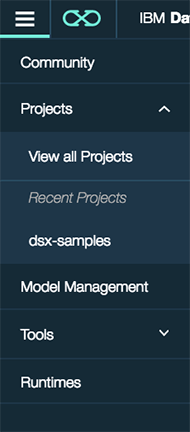
1. In the upper right corner, **Click** **+New Project**.  This will launch a new page called ***Create Project***
1.  In the ***name*** field, Enter a name.  This lab selected **GoWorkshop**.  **Click** **Create**
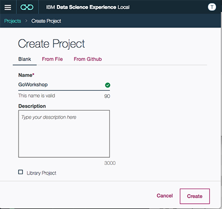
1. From the Project dashboard, **Click  +**  Then **Create Notebook**  This will launch the ***Create Notebook*** wizard
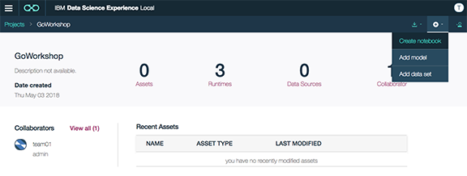
1. Enter in the ***Name*** of the notebook.  **GoWorkshopProject**.
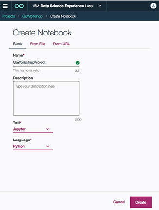
1. Toggle the **Language** to review, but select **Python**
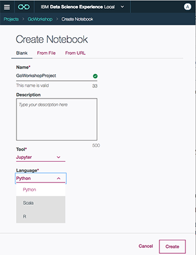
1. **Click Create**
1. Enter into the Notebook to the right of ***[1]***  `print("Go Workshop Python Sample");`  Then **Click** the run button circled in red.
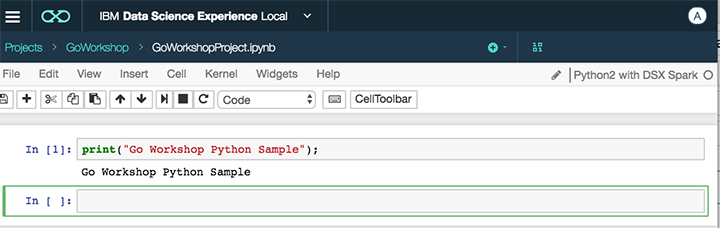

###  You just created a ***Hello World Project and Notebook***

1. Lets clean up and delete the project.
1. **Click** the elipse at the far right of the ***GoWorkshop*** project in the view all projects.
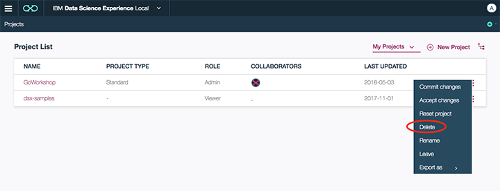

### You have successfully completed this lab
