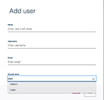
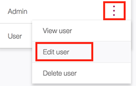
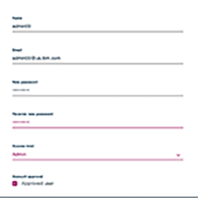

# DSX Lab 1: Creating and managing users

The objective of this lab is to show an administrator how to create and manage users.  The instructor should assign you numbers so that you do not clash and override one another.

## Create user

  1. Login to [https://10.50.88.240:8444](https://10.50.88.240:8444) as ***admin00*** using ***password00***
  1. Switch the drop down from **IBM Data Science Experience Local** to **Admin Console**
  1. Click ***(Hamburger Icon) -> User Management -> +add users***
    * Enter the following:
      * **Name:** (Your name) Example : ***admin01***
      * **Email:** (Your email) : It's not used but it's a required field in a valid email format
      * **Access Level:**   ***Admin***

        **Note:** DSX will provide a temporary password. This is the password to send to the user
        

## Assign password
   1. Click ***(Hamburger Icon) -> User Management
   on Actions column - > Click Pencil - Assign password*** as above:

   
   1. enter  ***passwordxx*** to the password.

   
   1. Click ***Save***

## Check Login for new user

   1. Signout as Admin (Top right corner)
   1. Login as new user
   1. Drop Down from **IBM Data Science Experience Local** to **Admin Console**
   1. Click ***(Hamburger Icon) -> User Management***
  1.  Look for Username (note STATUS column)
