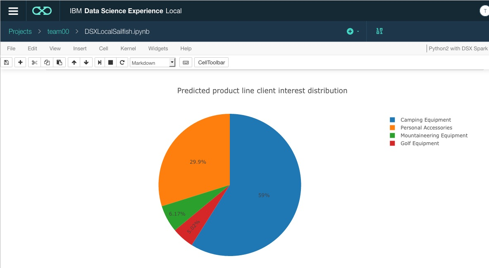
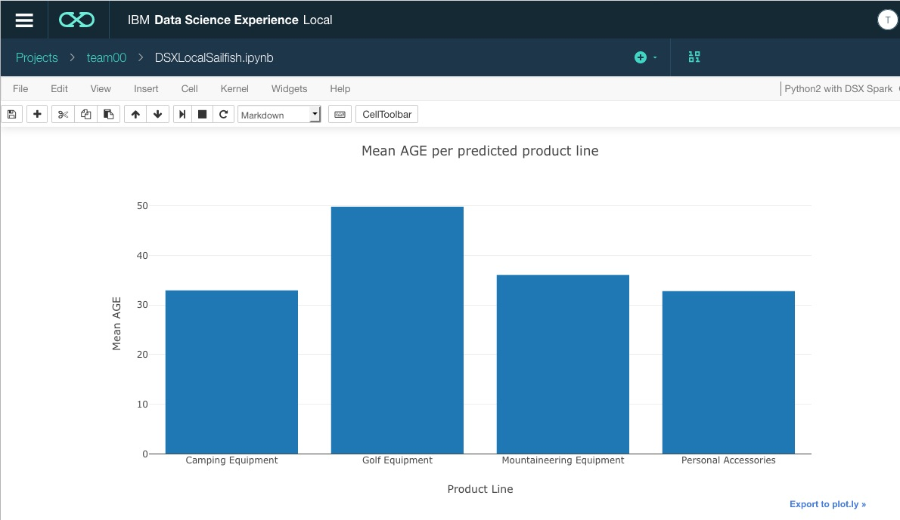
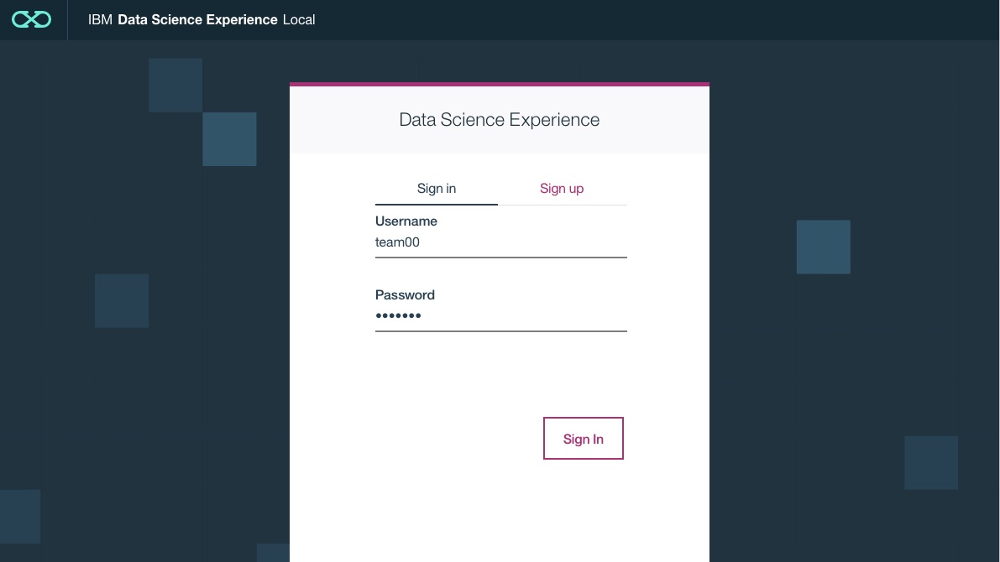
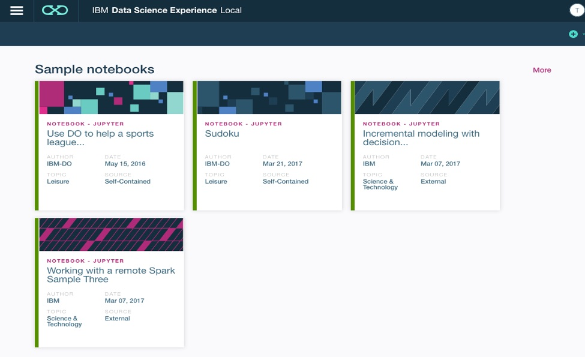
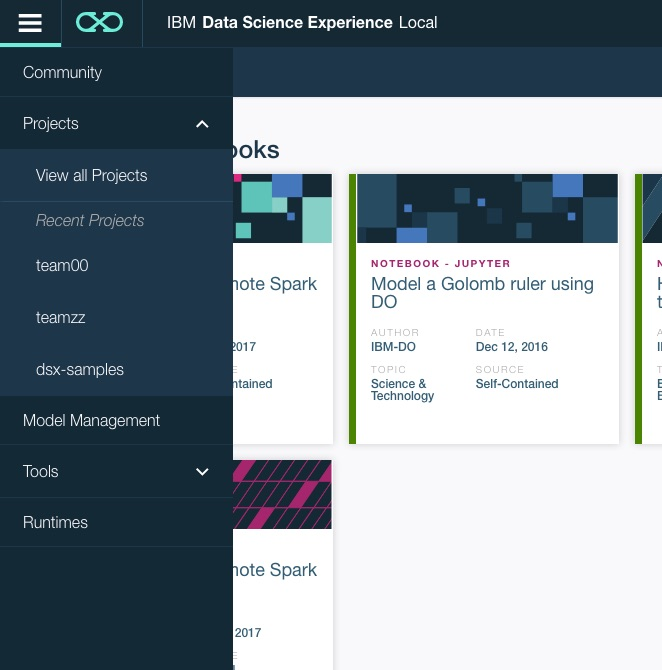
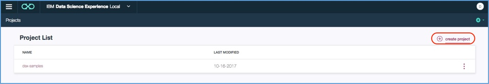
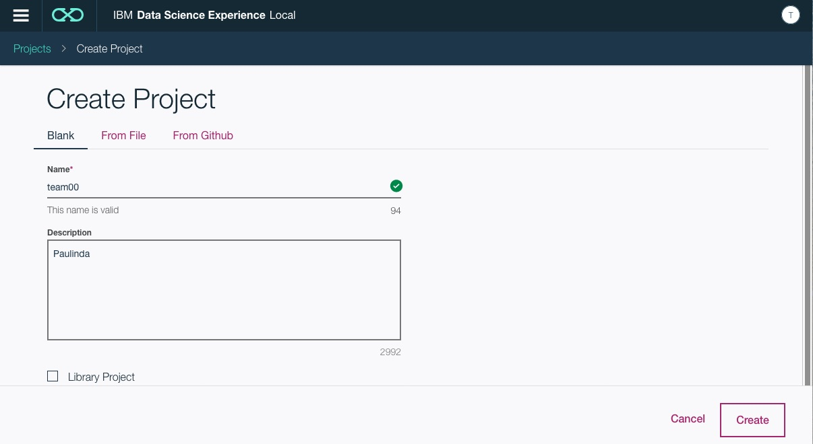
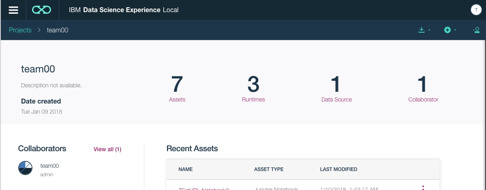
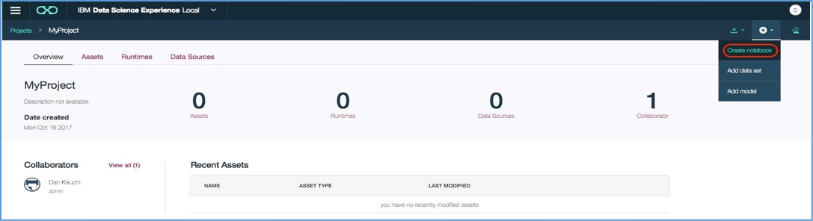
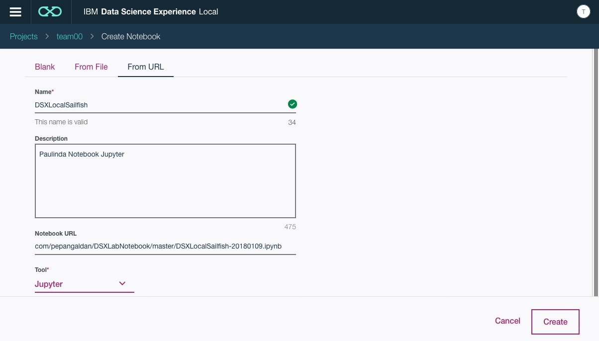

# Jupyter Notebook Predictive Modeling

IBM® Integrated Analytics System (IIAS) consists of a high-performance hardware platform and optimized database query engine software that work together to support various data analysis and business reporting features. There are multiple ways to analyze data on IBM® Integrated Analytics System - IBM® Data Science Experience (DSX), Spark, R , Analytic Stored Procedures, and Spatial Extender. In this tutorial, the focus is on DSX Integration on IIAS.  IBM® Integrated Analytics System (IIAS) includes and supports a one-node installation of DSX Local.

DSX Local is an out-of-the box on premises enterprise solution for data scientists and data engineers. It offers a suite of data science tools that are integrated with proprietary IBM technologies. It also seamlessly integrates with RStudio, Spark, Jupyter and Zeppelin notebook technologies. The intuitive user interface provides a Projects space for teams and individuals to efficiently collaborate, which will enable companies to more quickly make informed decisions.

### Lab Narrative

IER is a fictional sporting goods store specializing in selling outdoor sports equipment. Their product offerings include equipment for Golf, Camping, Mountaineering and Personal Accessories (apparel, foot wear, etc.) for these sports.
Changes in market trends, such as  disposable income and customer demographic, are not only major growth drivers for sales, but they also impact revenue growth.  So the store needs to identify its Target Market based on what its customers will likely purchase in the future using its own historical sales information.

The retail store does not have a big Data Science team, but they have staff who are skilled in Analytics.  The current process takes a long time and they are not able to meet the demands on time. The Executive Board is not looking for a complicated IT infrastructure to support their Analytics needs.  They want to be able to create sophisticated Analytics processes to accelerate decision making using a robust, but simple, IT infrastructure.

Your job is to support management’s vision to accelerate decision making

### Lab Overview

Using a Jupyter notebook in Python, we will provide steps and code to load data, explore data, create a predictive model, deploy the model, and start scoring with new data. In addition, we will introduce  basic data cleansing and exploration, and pipeline creation using Apache Spark machine learning (ML) packages. This lab uses data from Db2 Warehouse on Cloud. But you can use this lab to use data from IBM® Integrated Analytics System (IIAS) instead. You can analyze data from multiple data sources for DSX on IIAS – databases from IIAS , DB2 Warehouse on Cloud, DB2 on Z, HDP, Netezza, Informix and Oracle.

Some familiarity with Python is helpful but not necessary. The Jupyter notebook uses Python 2.0 and the runtime compute engine is IBM Apache® Spark 2.0.

### A Note about this Lab.

DSX on Integrated Analytics System includes a one node implementation. DSX Local can be a 3 or more node cluster.  There are slight differences between the two implementations, but the functionality remains the same.

  1) **Logging in:** DSX on Integrated Analytics System is launched from IIAS console under the **Develop Analytics** section. It requires separate credentials (user ID and password) from Integrated Analytics System login. The default DSX userID and password is **admin** **password**.

  2) **Additional Runtime Compute Engine:** DSX on Integrated Analytics System can connect to the Integrated Analytics System Spark service using Apache Livy.

  3) **Model Deployment Type:** Model Deployment will be explained later in this lab. For DSX on Integrated Analytics System, the only supported deployment type is Online (vs. Batch)

### Lab data

The data we are using is publicly available and can also be downloaded here
[GoSales Transactions](https://apsportal.ibm.com/exchange-api/v1/entries/8044492073eb964f46597b4be06ff5ea/data?accessKey=9561295fa407698694b1e254d0099600).  It contains historical outdoor sports equipment purchases for a fictitious company.

We will create a predictive model that will predict outdoor sports product interests based on a consumer's demographic: gender, age, marital status and profession. The product lines are: Personal Accessories, Mountaineering Equipment, Golf Equipment, Camping Equipment, Outdoor Protection, and Personal Accessories. Gender values are: M for Male, and F for Female. Marital Status are: Single and Married. Professions are as follows : Executive, Professional, Hospitality, Retired, Retail, Trades, Sales, Executive, Student and Other.

### Learning goals

The learning goals are:

   - Load data into an Apache Spark DataFrame.
   - Explore data.
   - Prepare data for training and evaluation.
   - Create an Apache Spark machine learning pipeline.
   - Train and evaluate a model.
   - Persist a pipeline and model.
   - Deploy a model for online scoring.
   - Score with sample data.
   - Explore and visualize prediction results using the plotly package.

### Lab Results

After completing this lab,  you will get a Pie-Chart similar to the one displayed below, showing the predicted client interest distribution for each product line. The chart shows that 59% of consumers are interested in camping equipment, 30% in personal accessories, 6% in mountaineering equipment, and 5% in golf equipment.

Additional Analyses – What is the predicted Consumer MEAN age for each product line?

Based on the Bar Chart, the mean ages for clients who are interested in camping equipment, golf, mountaineering equipment, and personal accessories are 32, 50, 36, and 34 years old, respectively.

## Predicting Outdoor Equipment Purchases Using Jupyter Notebook

As mentioned earlier, this part of the lab will import a Jupyter notebook . This notebook will include instructions and code to load and explore data, create a machine learning model, persist or evaluate the model, predict, deploy, visualize, and score the model. The result of this process is a prediction of product line interests based on a consumer’s gender, age, marital status and profession (predictors).

a) You will be assigned a **group number** and a **team number** at the beginning of the session. In this lab, a 'team' is an individual. Each individual will be assigned to a group. Each group will be a assigned a **different URL**, which will be shared at the **FastStart event**.

Open your browser and navigate to the web link assigned to your group. **Note:** If you get a Security notice that your web connection is not secure, add and confirm security exception.

To Sign In: Use your **team##** with a **password** of **sailfish##**,
 where **##** is your team number. (Note: teams 1 thru 9, precede with a '0')

 **Example**: username: team01
              password: sailfish01

 In the login screen, **Username** is team##. **Password** is (see example above). **Click**
 **Sign In**

 

1) After a successful sign in, several sample Community Notebooks will be displayed. The Community contains resources to help you learn more about data science.

   - Sample Notebooks

   

- Click the **More** button on the top right to get additional Community Notebooks. Please take a few moments to view the various assets available to get started with DSX quickly.

   

2) Now click on the hamburger icon (3-line icon on the top left). **Click** on **Projects** and **View all Projects**. A project is how you organize your resources - data assets, collaborators, and analytic assets such as notebooks, models.

 

  A list of projects will be listed for each user. Since this is the first time you've logged in, you will see one project named dsx-samples.  **Click** on **create project**.

3) In the **Create new project** screen , **Name** is the project name. Project names are unique. In this lab, use your team## as your project name (Example team00). **Name** is your **team##** (For example: team00). Be sure you remember the new project name . **Description** : Put your name. **Click** on **Create**.

 

 When your new project is created, you will see the resources available for that project. Note: Your screen content will vary from the sample screen below because you have not yet created those resources.

 

  **Click** the ** + ** icon. **Click** Create notebook

 

4)  In the **Create Notebook** screen, **Click** on **From URL**. Fill in the values for :
  - **Name** is DSXLocalSailfish
  - **Description** ‘YourName’ Notebook Jupyter (where YourName is your name)
  - **Notebook URL**:Copy-paste
    `https://raw.githubusercontent.com/pepangaldan/DSXLabNotebook/master/DSXLocalSailfish-20180109.ipynb`
  - **Tool** dropdown select **Jupyter** . Review to verify that you copy-pasted the URL location correctly.
 

  Backup Github site: `https://raw.githubusercontent.com/dxkikuchi/DSX/master/DSXLocalSailfish/DSXLocalSFBU.ipynb`

The step above will import a Jupyter notebook from GitHub into your DSX Local environment. You can also import a notebook from a file or create a notebook from scratch. This process will load the Jupyter notebook into the DSX environment, as well as start processing the kernel – Python2 with DSX Spark. Be sure that the kernel has started before executing any of the code cells by watching the top right of the notebook. While it's starting, you will see a feedback that the kernel is starting. This process is quick, so you may not see it but you need to be aware.

A primer on Jupyter notebook:

   - To run each cell, **click** on    which is located on the CellToolbar (Underneath the Menu – (File, Edit, View, etc)).
   
   - To execute each cell, click on each cell. Below is an example of a cell. While the cell is running, you will see an asterisk (\*) next to the bracket []. This means that the cell is executing, so you need to wait until it completes, before executing the next cell. The cell will be assigned a number inside the bracket [] when it's executed. The numbers are assigned based on when they are ran, and it's not relevant to how the statements in the notebook will be processed. For example, if you've ran the first cell and you get [1], if you decide to run it again, after cell 3, note that cell 1 will be assigned [4]. Cells that do not have a bracket are non-executable cell. There is no need to execute them. These cells provide clarification, explanation or instructions.
   
   - The results will be listed under each cell. Below is an example of an executed cell. Based on the cell number, it is the first cell executed for this run.

      

  - Please walk through the notebook by reading and executing the code cells. There are explanations before and after cell execution to help you understand what is being accomplished.

**You have completed Juptyer Notebook Predictive Modeling lab!!** The final results should be familiar - they are the same as the **Lab Results** section which was explained earlier.

## SUMMARY

You learned how to use DSX's Jupyter Notebook and load data into a Spark DataFrame for predictive modeling creation and deployment.

You **completed** the tutorial. **Congratulations!!!**

