# Migration Lab

The following details the Migration Lab.  This lab is a simulation of a simple  IBM Integrated Analytics System (IIAS) Migration POC pulling data and queries from an existing Netezza system (see [Lab Narrative](/Labs/Migration/LabNarrative.md)).  

This lab has 5 steps.
1. Extracting the DDL from the Netezza system using Harmony Profiler.
1. Running and reviewing the assessment from the tooling
1. Converting the ddl from Netezza to Db2 Warehouse ready ddl.
1. Creating the tables in Db2 Warehouse using the converted scripts
1. Run db_migrate to move the data from Netezza to Db2 Warehouse.


You will migrate an existing database on a Netezza system to Db2 Warehouse local emulating IIAS Db2 Warehouse.  

## Lab Narrative

Read the [Lab Narrative](/Labs/Migration/LabNarrative.md) to understand the background of the Lab/POC.

## Lab Exercise

Please see your assignments by team for the database that you are to migrate.  Since the Db2 Warehouse environment only supports a single database you are migrate the database using the database as part of the schema name.

For this lab you can ssh to the IIAS container or use your Db2 Client container.


## Phase 1 of POC
Phase 1 of the POC will be to migrate assess the compatibility of the schemas and tables in Netezza to be moved to Db2 Warehouse.   There are 26 tables from the Netezza system to IIAS.  During a migration there is a well worn path to success when migrating from Netezza to Db2 Warehouse.  

In phase one, an assessment will be done to understand the scope of the effort.  As a guide, the [PDA to Db2 questionaire](./PDA2Db2Questionnairev3.pdf) is used by IBM Migration lab services to as much of the information needed to do a proper sizing.  We will focus on collecting the database information and the tools used to help expedite the database migration.  Other applications that access the migrated data will need to be updated and in some cases changed.  The tooling will assess what is in the ddl that will port without change, areas of the ddl that the tool can change and then areas of manual intervention.   This tool will not optimize the ddl for performance, just make it run.  Your expertise is used to optimize for performance.

### Evaluate the ddl
1. Login to the vm using
1. Execute the [gather_nz_info.sh](./gather_nz_info.sh) on the Netezza machine.  In this case we have run this for you and is located in `~/nz` on the VM.  Part of the information gathered will be .ddl files which are used with the Harmony Profiler.
  1. Review the output for of the files.  These files are in `~/nz/tmp/nz/gather_nz_info`
  1. Look at
1. Start the Harmony Profiler.  
  1. Double click the ***db_harmony_profiler.sh*** desktop launcher.  This will start Harmony Profiler.
  	 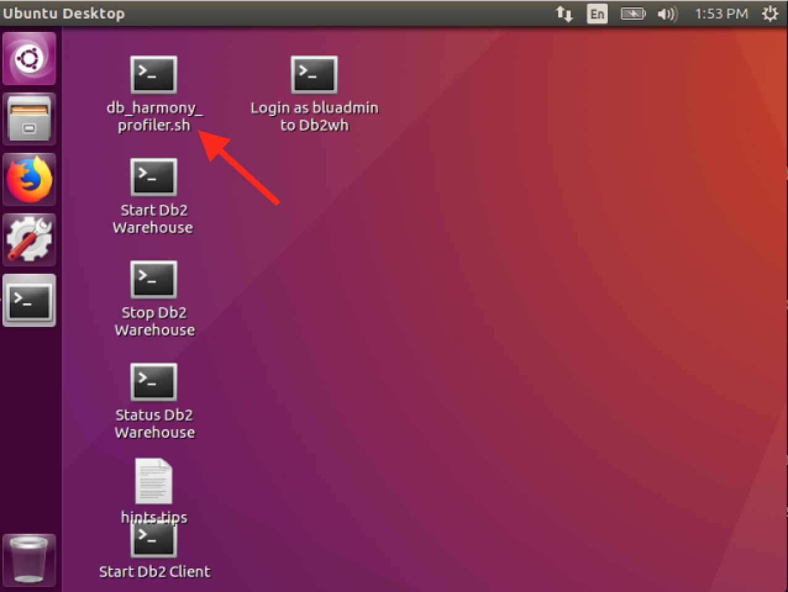
1. Check the compatibility between Netezza DDL extracted and and what is expected in Db2 Warehouse.  
  1. Click on ***Select Input Files*** button on the Harmony Profiler.
  1. Browse to `~/nz/tmp/nz/gather_nz_info` and select all of the `extracted.BDI.dll` file.  If desired, review the others, but in this lab we are focused on BDI.
  1. Select ***PureData Systems for Analytics*** from the **Source Database Brand**   ***Note:*** you can also select ***Oracle***
  1. Select ***Db2 Warehouse*** for the **Target Database Brand**.
  1. Click on ***Check Compatibility***
   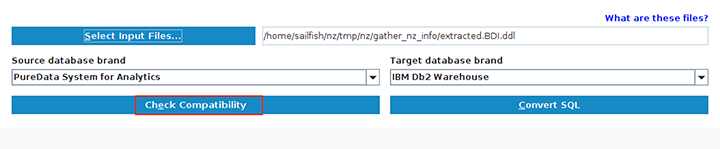

   ***Note:*** The Harmony Profiler can also be run from the command line.  Which you will see at the end.
  1. Review the findings by double clicking on the result.
  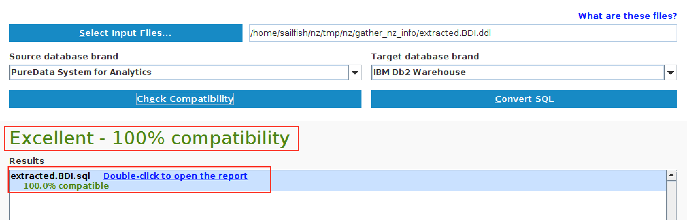
  1. The HTML report will be launched showing the ***Summary*** page.
  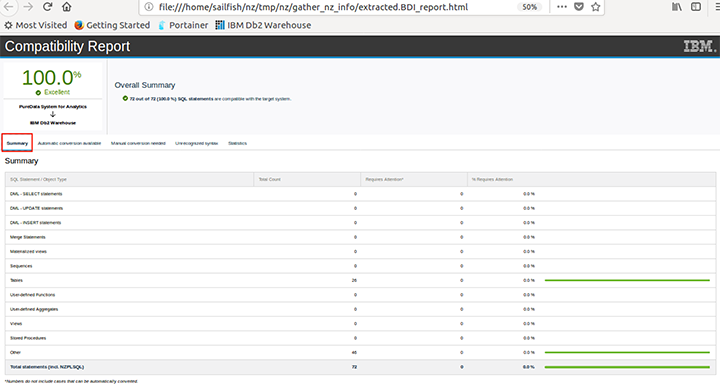
  1. Switch to the next tab that shows ***Automatically conversion available*** tab.  Expand the `+` sign to see more details.
  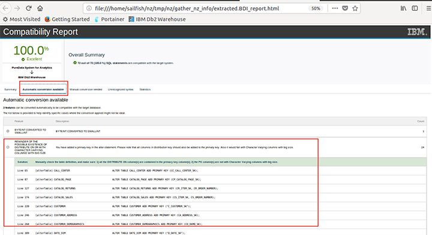
  1. Switch to the ***Manual conversion needed*** tab.
  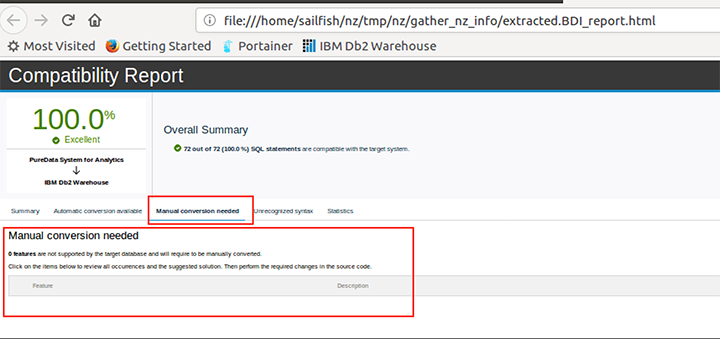
  1. Switch to the ***Unrecognized Syntax*** tab
    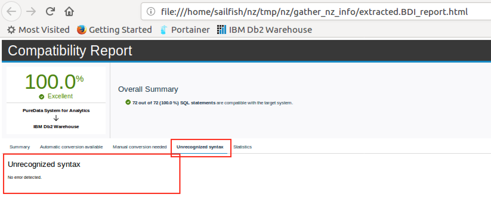
  1. Switch to the ***Statistics*** tab.
   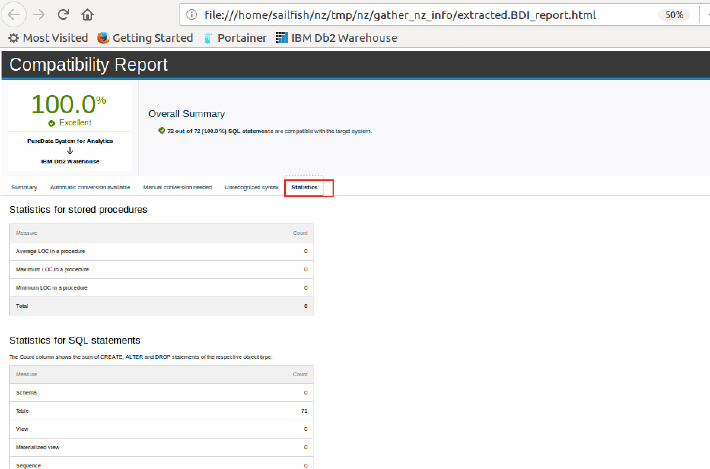

  ### Convert the ddl
  Since reviewing the evaluation and all seems pretty clean, go ahead back to the tool.   
  1. Click on ***Convert SQL***
  
  1. Double Click result to review converted ddl.
  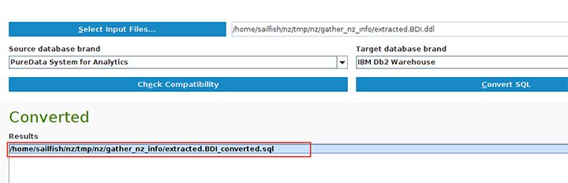
  1. Review the converted ddl. One thing to note in the conversion, the create database statement has be converted into a schema.  IBM Integrated Analytics System currently only has one database. When migrating use schemas for multiple databases.
  
  1. The file is saved in the `~/nz/tmp/nz/gather_nz_info` directory as `extracted.BDI_converted.sql`

  ### ***Optional:*** Excuting from the command line.

    1. `cd /home/sailfish/db_harmony`
    1. Execute `./db_harmony_profiler.sh -help |more` to find the options.
    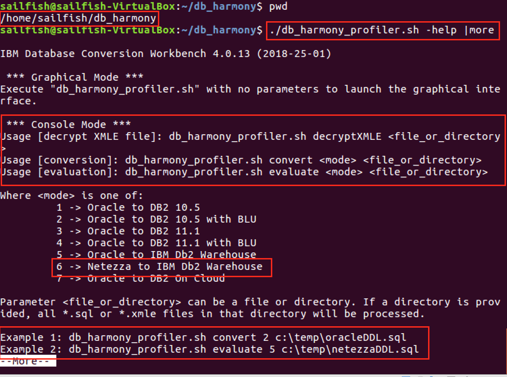
    1. `./db_harmony_profiler.sh evaluate 6 <ddl or sql file>`

  ### Cleaning up the converted ddl
  The Command line `dbsql -f <file name>` is more forgiving than the Db2 Warehouse console.  For this lab we are going to go the picky route.  In the Loading lab, the command line approach will be taken.   The console's Run SQL will not tolorate the following:
    ~~~
    /*Netezza slash statement(s) removed <<
    \echo
    \echo *****  Creating database:  "BDI"
    >> Netezza slash statement(s) removed  - END*/
    ~~~

  or `@`

  1. The simple conversion if find `@` replace with `;`
  1. Next is to delete out everything from `/*` to `*/`.  In the earlier example using `vi` this would take 4 `dd` keystrokes for each instance.
  1. In the interest of time, the sql file has been cleaned for you.  `~/nz/tmp/nz/gather_nz_info/extracted.BDI_converted.cleaned.sql` This file will be opened in the Db2 Warehouse console and run as SQL.
  1. From the browser, click the ***Db2 Warehouse***
    
  1. Login in as `bluadmin/blueadmin`.  It could be pre-saved for you.  
  1.  Click on the 3 green bars at the upper left.  Then click ***Run SQL***.
  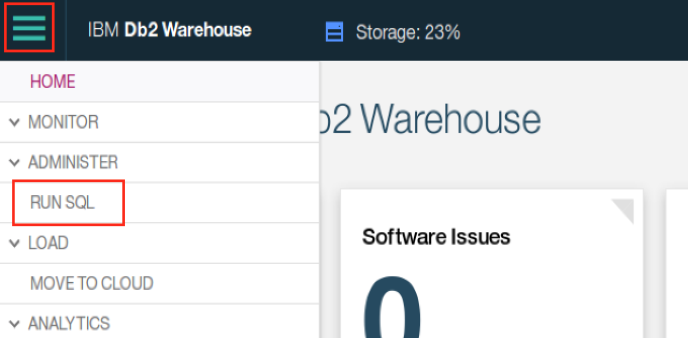
  1. Click ***Script*** then ***Open from client***
  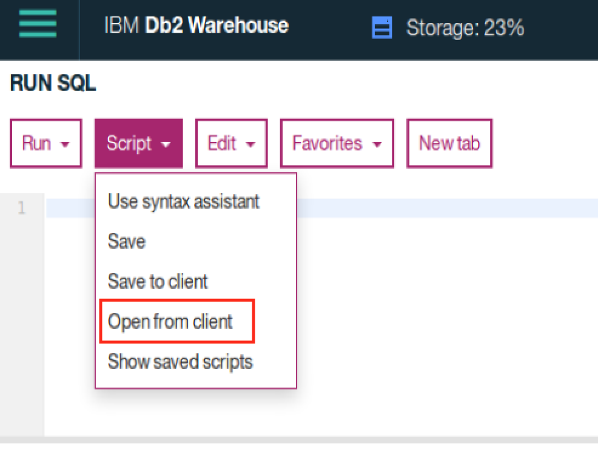
  1. Select ***Browse*** then select `~/nz/tmp/nz/gather_nz_info/extracted.BDI_converted.cleaned.sql` file and click ***Open***.
  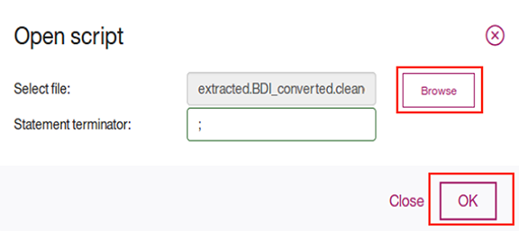
  1. Review the imported SQL, then click ***Run All***
  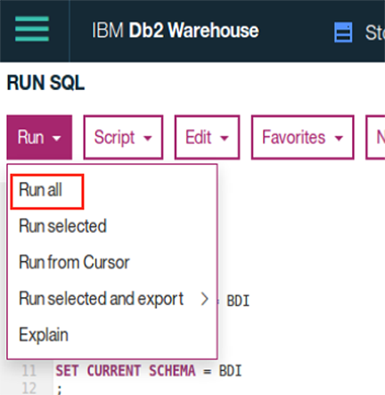
  1. Review the results.  Notice that there were no failures.  
  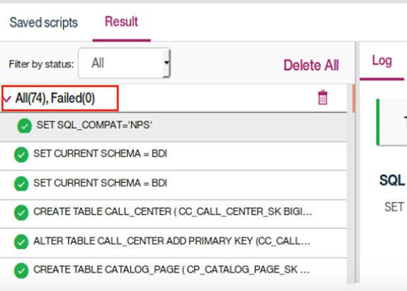
  1. If there were you can investigate on the panel to the right.  The execution time, action and results are easily accessible from this panel.
  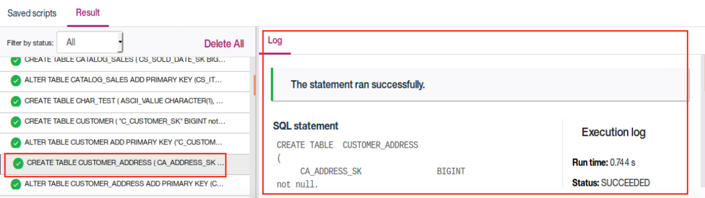

Schema and tables are all created.  Next step is to migrate the data from Netezza to Db2 Wareshouse.   

### Migrate the Data from Netezza to Db2 Warehouse

Utilize the `db_migrate` script available in the Db2 Warehouse client container or in the Db2 Warehouse server container.

Please migrate your assigned database to your assigned target schema, see assignments above.

1. Login into the Db2 Warehouse local container on your vm.
  1. Click the **Login as bludmin to Db2wh** desktop launcher.  This log you into the Db2 Warehouse container as ***bluadmin***.
  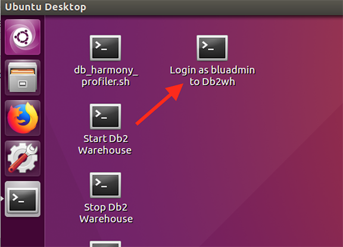

  1. From the command prompt type `db_migrate -h`.

    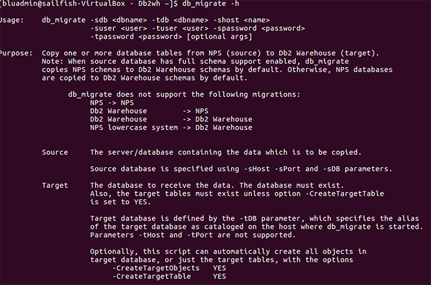
  1. Take note at the beginning of the output.  There are arguments that start with **s** some with **t**.  **s** stands for the **source** or in our case Netezza and **t** stands for **target** or in our case Db2 Warehouse/IIAS.  

    `db_migrate -sbd <Netezza database name> -tdb <Db2 Warehouse database name> -shost <hostanme> -thost <Db2 Warehouse host> -suser <remote DB username> -tuser bluadmin -spassword <remote DB username> -tpassword bluadmin`

  1.  For this lab, you need to run a few commands since we are running a none standard port and db_migrate is not properly working with `-sport` argument.  None fo this would be necessary if we were using an IIAS system.  So bare with this hack.
    1. When ever you start a Db2 Wh local container, it will re-secure any changes I make to sshd.  So for simplicity we will run the following.
    1. Start a terminal and log into the docker container for Db2 Warehouse.

        `$ docker exec -it Db2wh sh`
    1. Replace the sshd_config file

        `$ cp /mnt/clusterfs/scratch/workaround/sshd_config /etc/ssh/sshd_config`
    1. Restart the sshd.

        `$ service sshd restart`
    1. Map a route from the local machine to the remote Netezza machine mocking the default port.

        `ssh -L 5480:services-uscentral.skytap.com:9053 root@localhost -p 50022`    
    1. It will prompt for a password.  `root@localhost's password:`  Enter `sailfish`

        ***Note:*** Ignore Errors from SSH command
    1. Now super user to bluadmin
        `su bluadmin`

    1. Run the db_migrate command to move the data over.
    `db_migrate -shost localhost  -cksum yes -loader extTab -threads 2 -sDB bdi -tDB bludb -sUser admin -tUser bluadmin -sPassword password -tPassword bluadmin -schema admin -tschema bdi`

    1. This command will run 10-30 minutes depending on RAM, Network CPU etc.  From IIAS to Netezza machine the average time is 10 minutes.  Since this is on a VM, your performance milages will vary.
    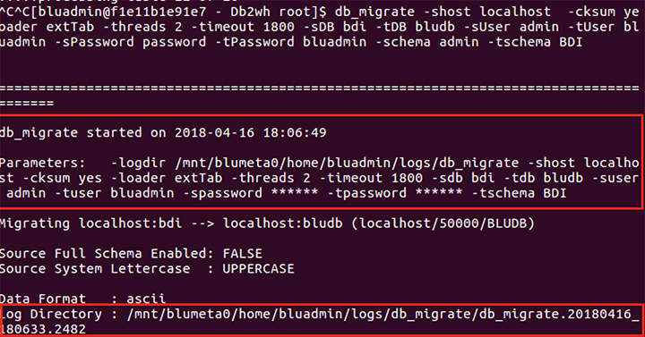
1.  While this is running, let's see what can be reviewed while `db_migrate` runs .  Go to the terminal where `db_mgrate` is running and scroll back up and cp the log directory.    
1. Open a new terminal by launching `Login a Bluadmin`  or `$ docker exec -it Db2wh sh`
1. Change directories to the log directory and execute a list of the files.
  1. `db_migrate.output` is essentially the console output, so there is no need to direct this to a file.
  1. The log files will change as tables are being migrated over.
  1. if you see any with `.bad` at the end, then you will have some investigating to do.
  1.  When a `.bad` file is dropped by the command, the matching `.log` file is where to start the investigation.

Verify that your migrated rows match the rows in the source system.
[NZ Table counts](/Labs/Migration/BDI_rowcounts.md )

Compare the table sizes between the Netezza and IIAS.  On IIAS use the `db_size` script to get tables size information.
[NZ Table sizes](/Labs/Migration/BDI_DBSize.md)

[Sample migration script](/Labs/Migration/migrate.sh)

Report any issues found during initial migration and correct all errors.

Did you have any tables fail during the db_migration?  
How many tables failed? Why?  
How did you fix the failed tables?  

Single table migration [script](/Labs/Migration/migrate-table.sh) example.

If you want a peak at the answers, try this page. [NZ Table counts](/Labs/Migration/Answers.md )


## Phase 2 of POC

Phase 2 convert and run the following Netezza queries:

* Run as-is and see what error you receive.  Then convert the SQL to run on Db2 Warehouse.

> Note: set your schema before running these queries.
`set current schema bdi`


### SQL1
```
SELECT CC_REC_START_DATE + 10 from CALL_CENTER LIMIT ALL;
```

### SQL2
```
SELECT CC_REC_START_DATE + interval '10 days' from CALL_CENTER;
```

### SQL3
```
insert into UTF8_TEST values ("abcd", "abcd", 4); --SAMPLE_STRING
```

### SQL4
```
INSERT INTO UTF8_TEST(BASE_LANGUAGE, SAMPLE_STRING, DISTRIBUTION_COLUMN) values( 'abcd' , 'euro euro', 4);
```

### SQL5
```
INSERT INTO UTF8_TEST(BASE_LANGUAGE, SAMPLE_STRING, DISTRIBUTION_COLUMN) values( 'abcd' , 'euro euro', 4);
```

### SQL6
```
INSERT INTO WEB_PAGE values ( 10,cast('id' as varchar(10)), now() , CURRENT_DATE ,10,10,'y',10,'y', substr('wearehere', 4), 10,10,10,10);
```

### SQL7
```
SET FACTREL_SIZE_THRESHOLD = 25000000;
SELECT NUMERIC(WR_RETURN_AMT) FROM WEB_RETURNS;
```

### SQL8
```
SELECT NUMERIC(WR_RETURN_AMT,7,2) FROM WEB_RETURNS;
```

### SQL9
```
SELECT (WR_RETURN_AMT)::NUMERIC(7,2) FROM WEB_RETURNS;
```

* [Netezza Source DML](/Labs/Migration/NZQueries/nzbdinsights.sql)
