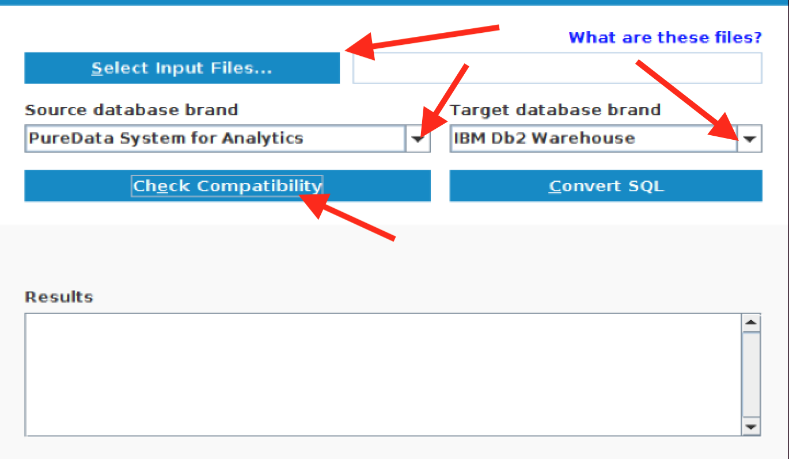

# Migration Lab

The following details the Migration Lab.  This lab is a simulation of a simple  IBM Integrated Analytics System (IIAS) Migration POC pulling data and queries from an existing Netezza system (see [Lab Narrative](/Labs/Migration/LabNarrative.md)).  

This lab has 5 steps.
1. Extracting the DDL from the Netezza system using Harmony Profiler.
1. Running and reviewing the assessment from the tooling
1. Converting the ddl from Netezza to Db2 Warehouse ready ddl.
1. Creating the tables in Db2 Warehouse using the converted scripts
1. Run db_migrate to move the data from Netezza to Db2 Warehouse.


You will migrate an existing database on a Netezza system to Db2 Warehouse local emulating IIAS Db2 Warehouse.  

## Lab Narrative

Read the [Lab Narrative](/Labs/Migration/LabNarrative.md) to understand the background of the Lab/POC.

## Lab Exercise

Please see your assignments by team for the database that you are to migrate.  Since the Db2 Warehouse environment only supports a single database you are migrate the database using the database as part of the schema name.

For this lab you can ssh to the IIAS container or use your Db2 Client container.

### Direct ssh to IIAS Db2 Warehouse container

#### team01-team06  
   `ssh teamXX@9.30.106.50 -p 50022`  # where XX is your assigned team number  

#### team07-team12  
   `ssh teamXX@9.30.106.115 -p 50022`  # where XX is your assigned team number

## Database migration assignments by team

   ### Database migration

  | Team/User | Source Host  | Target Host  | Source Database  | Target Database  | Source Schema  | Target Schema  |
  |:---:|:---:|:---:|:---:|:---:|:---:|:---:|
  | team01  | 9.30.106.112  | 9.30.106.50  | bdi01 | bludb  | BDINSIGHTS  | bdi01  |


## Phase 1 of POC
Phase 1 of the POC will be to migrate assess the compatibility of the schemas and tables in Netezza to be moved to Db2 Warehouse.   There are 26 tables from the Netezza system to IIAS.  

### Evaluate the ddl
1. Login to the vm using
1. Execute the `gather_nz_info.sh` on the Netezza machine.  In this case we have run this for you and is located in `~/nz` on the VM.  Part of the information gathered will be .ddl files which are used with the Harmony Profiler.
1. Start the Harmony Profiler.  
  1. Double click the db_harmony_profiler.sh desktop launcher.  This will start Harmony Profiler.
  	 
1. Check the compatibility between Netezza DDL extracted and and what is expected in Db2 Warehouse.  
  1. Click on ***Select Input Files*** button on the Harmony Profiler.
  1. Browse to `~/nz` and select all of the `.dll` files.
  1. Select ***PureData Systems for Analytics*** from the **Source Database Brand**   ***Note:*** you can also select ***Oracle***
  1. Select ***Db2 Warehouse*** for the **Target Database Brand**.
  1. Click on ***Check Compatibility***
   
   ***Note:*** The Harmony Profiler can also be run from the command line.  
    1. `cd /home/sailfish/db_harmony`
    1. Execute `./db_harmony_profiler.sh -help |more` to find the options.
    
    1. `./db_harmony_profiler.sh evaluate 6 <ddl or sql file>`


1. Review the output from in the results window.

  ## Insert image here

### Convert the DDL from Netezza to Db2 Warehouse
1. Click on Convert SQL.

  ## Insert image here

###  Create the Schema and Tables

    ## Insert instructions here
    ## Insert image here

### Migrate the Data from Netezza to Db2 Warehouse

Utilize the `db_migrate` script available in the Db2 Warehouse client container or in the Db2 Warehouse server container.

Please migrate your assigned database to your assigned target schema, see assignments above.

1. Login into the Db2 Warehouse local container on your vm.
  1. Click the **Login as bludmin to Db2wh** desktop launcher.  This log you into the Db2 Warehouse container as ***bluadmin***.
  

  1. From the command prompt type `db_migrate -h`.

    
  1. Take note at the beginning of the output.  There are arguments that start with **s** some with **t**.  **s** stands for the **source** or in our case Netezza and **t** stands for **target** or in our case Db2 Warehouse/IIAS.  

    `db_migrate -sbd <Netezza database name> -tdb <Db2 Warehouse database name> -shost services-uscentral.skytap.com -thost <Db2 Warehouse host> -suser nz -tuser bluadmin -spassword nz -tpassword bluadmin`

    * NZ User ID : ***nz***
    * NZ Password: ***nz***


Verify that your migrated rows match the rows in the source system.
[NZ Table counts](/Labs/Migration/BDI_rowcounts.md )

Compare the table sizes between the Netezza and IIAS.  On IIAS use the `db_size` script to get tables size information.
[NZ Table sizes](/Labs/Migration/BDI_DBSize.md)

[Sample migration script](/Labs/Migration/migrate.sh)

Report any issues found during initial migration and correct all errors.

Did you have any tables fail during the db_migration?  
How many tables failed? Why?  
How did you fix the failed tables?  

Single table migration [script](/Labs/Migration/migrate-table.sh) example.

### Extra Credit: Migrate Netezza tables using IBM Database Harmony Profiler

1. Drop all tables migrated above.  

   #### Using Db2 CLP  
      * Inside the Db2 Warehouse Server container  
        `db2 connect to bludb`  

      * From your Db2 Warehouse Client container  
        `db2 connect to <your-remote-DB> user <your-team-ID> using Sailfish@2018`  

      `db2 -x "list tables for schema bdiXX_bdi" |awk '{print "drop table " $2 "."  $1 ";"}' |db2`  
      * Where XX is your assigned team number.  

1. Use [IBM Data Harmony Profiler](https://www.ibm.com/developerworks/community/blogs/05901c97-75b2-47a1-9c32-25f748855913/entry/Introducing_DCW_Lite?lang=en) to create tables prior to running db_migrate.
> Note: Db2 Harmony Profiler Tool download link available in IIAS Console.  

   * [Netezza Source DDL](/Labs/Migration/NZQueries/nzbdinsights.ddl)

1. Run the converted DDL.  Make sure that your schema is teamXX, where XX is your assigned team number.

1. Run db_migrate without `-RecreateTargetTable yes -CreateTargetTable yes`

   Did you have any failed tables?

## Phase 2 of POC

Phase 2 convert and run the following Netezza queries:

* Run as-is and see what error you receive.  Then convert the SQL to run on Db2 Warehouse.

> Note: set your schema before running these queries.
`set current schema bdiXX`
* Where XX is your assigned team number.

### SQL1
```
SELECT CC_REC_START_DATE + 10 from CALL_CENTER LIMIT ALL;
```

### SQL2
```
SELECT CC_REC_START_DATE + interval '10 days' from CALL_CENTER;
```

### SQL3
```
insert into UTF8_TEST values ("abcd", "abcd", 4); --SAMPLE_STRING
```

### SQL4
```
INSERT INTO UTF8_TEST(BASE_LANGUAGE, SAMPLE_STRING, DISTRIBUTION_COLUMN) values( 'abcd' , 'euro euro', 4);
```

### SQL5
```
INSERT INTO UTF8_TEST(BASE_LANGUAGE, SAMPLE_STRING, DISTRIBUTION_COLUMN) values( 'abcd' , 'euro euro', 4);
```

### SQL6
```
INSERT INTO WEB_PAGE values ( 10,cast('id' as varchar(10)), now() , CURRENT_DATE ,10,10,'y',10,'y', substr('wearehere', 4), 10,10,10,10);
```

### SQL7
```
SET FACTREL_SIZE_THRESHOLD = 25000000;
SELECT NUMERIC(WR_RETURN_AMT) FROM WEB_RETURNS;
```

### SQL8
```
SELECT NUMERIC(WR_RETURN_AMT,7,2) FROM WEB_RETURNS;
```

### SQL9
```
SELECT (WR_RETURN_AMT)::NUMERIC(7,2) FROM WEB_RETURNS;
```

* [Netezza Source DML](/Labs/Migration/NZQueries/nzbdinsights.sql)
