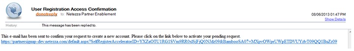
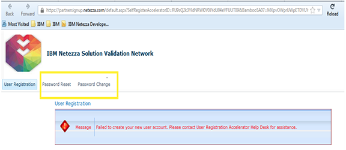

# Partner access to IBM Integrated Analytics System

If enrolled in a workshop, then follow the steps below to in "How to get a Partner Account" verify that your company has access to the system for the workskop.

If not in a workshop and want to gain access to the IIAS system, you will need to follow the steps in the [Partner Access Document](ExternalPartnerAccess.pdf).

## How to get a Partner Account
1. Go to: [https://partnerportal.im-ies.ibm.com](https://partnerportal.im-ies.ibm.com)
   >
Fill out all the information and click the Register button.
If you get an invalid email address message, your company’s access to the partner lab has not been activated.  ***Note:*** Please send an email to askbpe@us.ibm.com letting us know your company has not been activated.
1. You will receive an email with a link to validate your registration request:
   >
1. Click on the link and ensure the screen you see says “Successful registration”.
   >
***Note:*** If you get an error please copy and paste a screen shot into an email and send to askbpe@us.ibm.com so we can help address the issue.
1. Click the think to ensure that you can log in to download the Cisco VPN client.  the VPN will be preinstalled for you during the workshop.  But this verifies that you can get access to the IBM Integrated Analytics System use in the workshop.  [https://sccvpn.im-ies.ibm.com/+CSCOE+/logon.html#form_title_text](https://sccvpn.im-ies.ibm.com/+CSCOE+/logon.html#form_title_text)
1. You will connect to `sccvpn.im-ies.ibm.com`

## Changing Password or reset
1. Go to: [https://partnerportal.im-ies.ibm.com](https://partnerportal.im-ies.ibm.com)
1. Click either Reset or Change Password.
>
